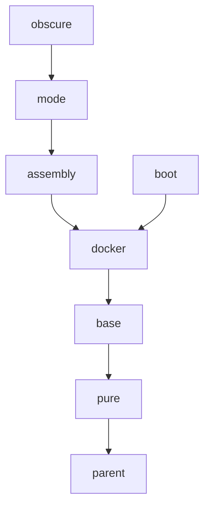

# maven parent pom

在构建基于Maven的项目时，可以在`pom.xml`文件中，通过`<parent>`来复用一些预定义的依赖和项目描述信息。

本项目中，提供了一些常用的预定义依赖，它们包括：

| 名称 | 用途 |
| ---| --- |
| parent | 所有父项目的继承根。包含项目的编码设置；Maven基础插件版本；代码发布相关设置 |
| pure | 用于纯Java的父项目。包含编译级别；打包相关的插件设置；代码质量相关的报告插件设置 |
| base | 引入常用的基准依赖包。包含slf4j和Apache Commons |
| docker | 将Jar打包发布成Docker Image |
| assembly | 使用maven-assembly-plugin来打包可执行jar |
| mode | 以不同的运行模式来打包可执行jar |
| obscure | 打包后做源代码混淆，防止反编译 |
| boot | 以spring-boot.jar的方式来打包可执行jar |

本文包含以下内容：

1. [继承关系](#继承关系)
1. [预定义的配置项](#预定义的配置项)
1. [预定义的依赖](#预定义的依赖)
1. [预定义的依赖声明](#预定义的依赖声明)
1. [预定义的插件](#预定义的插件)
1. [预定义的插件声明](#预定义的插件声明)
1. [预定义的Profile](#预定义的profile)
1. [代码仓库相关配置](#代码仓库相关配置)

### 继承关系

这些父项目之间的继承关系如下：



---

### 预定义的配置项

父项目中以`<property>`的方式预定义了一些配置项，在子项目中可以通过覆盖的方式修改这些配置项，以达到定制化的目的。

预定义的配置项如下：

| 父项目 | 属性 | 默认值 | 描述 |
| --- | --- | --- | --- |
| parent | project.encoding | UTF-8 | 项目的默认编码 |
| parent | project.build.sourceEncoding | `${project.encoding}` | 源文件的默认编码 |
| parent | project.reporting.outputEncoding | `${project.encoding}` | 报告输出文件的默认编码 |
| parent | project.site.root | `file://${env.HOME}/.m2/sites` | 本地报告站点的根目录，Profile`site-local`激活时 |
| parent | project.site.root.project | `${project.site.root}/${project.git.uri}` | 本地报告站点的项目根目录，Profile`site-local`激活时 |
| pure | project.java.version | 1.8 | Java版本 |
| pure | maven.compiler.compilerVersion | `${project.java.version}` | Java编译级别 |
| pure | maven.compiler.source | `${project.java.version}` | Java源文件版本 |
| pure | maven.compiler.target | `${project.java.version}` | Java编译文件版本 |
| docker | project.docker.image.prefix | `${project.git.group}` | Docker Image文件的前缀，Profile`docker`激活时 |
| docker | project.docker.image.tag | `${git.commit.id.describe}` | Docker Image文件的标签(版本号)，Profile`docker`激活时 |
| docker | project.docker.image.jar | `${project.build.finalName}.jar` | 用于构建Docker Image的Jar包名称，Profile`docker`激活时 |
| assembly | project.mainClass | 无默认值，必须在子项目中设置 | 可执行jar的主类 |
| mode | project.mode | dev | 运行模式，Profile`mode-resource-filtering`激活时 |
| boot | project.spring-boot.attach | false | 是否发布Spring Boot打包后的可执行Jar，Profile`spring-boot`激活时 |
| boot | project.spring-boot.classifier | boot | 可执行Jar的classifier后缀名称，Profile`spring-boot`激活时 |

---

### 预定义的依赖

本系统中包含如下预定义的依赖：

| 父项目 | groupId | artifactId | 备注 | 
| --- | --- | --- | --- |
| pure | org.junit.jupiter | junit-jupiter-engine | Profile`java-test`激活时 |
| base | org.slf4j | slf4j-api |
| base | org.slf4j | jul-to-slf4j | runtime |
| base | org.slf4j | jcl-over-slf4j | runtime |
| base | org.apache.commons | commons-lang3 |
| base | commons-io | commons-io |

---

### 预定义的依赖声明

依赖声明`<dependencyManagement>`用于声明依赖项的版本信息。本系统中包含如下预定义的依赖声明：

| 父项目 | 属性 | 默认版本 | groupId | artifactId | 备注 | 
| --- | --- | --- | --- | --- | --- |
| pure | version.junit-jupiter | 5.9.2 | org.junit.jupiter | junit-jupiter-engine | Profile`java-test`激活时 |
| base | version.slf4j | 2.0.6 | org.slf4j | slf4j-api |
| base | version.slf4j | 2.0.6 | org.slf4j | jul-to-slf4j |
| base | version.slf4j | 2.0.6 | org.slf4j | jcl-over-slf4j |
| base | version.slf4j | 2.0.6 | org.slf4j | log4j-over-slf4j |
| base | version.commons-lang3 | 3.12.0 | org.apache.commons | commons-lang3 |
| base | version.commons-io | 2.11.0 | commons-io | commons-io |
| base | version.commons-codec | 1.15 | commons-codec | commons-codec |
| base | version.commons-beanutils | 1.9.4 | commons-beanutils | commons-beanutils |
| base | version.commons-collections4 | 4.4 | org.apache.commons | commons-collections4 |

---

### 预定义的插件

本系统中包含如下预定义的插件：

| 父项目 | groupId | artifactId | 备注 | 
| --- | --- | --- | --- |
| parent | org.apache.maven.plugins | maven-enforcer-plugin |
| parent | org.codehaus.mojo | versions-maven-plugin | 生成报告时 |
| parent | org.apache.maven.plugins | maven-gpg-plugin | Profile`release`激活时 |
| parent | org.apache.maven.plugins | maven-release-plugin | Profile`release`激活时 |
| parent | org.sonatype.plugins | nexus-staging-maven-plugin | Profile`distribution-ossrh`激活时 |
| pure | org.apache.maven.plugins | maven-jxr-plugin | Profile`java-main`激活，生成报告时 |
| pure | org.apache.maven.plugins | maven-checkstyle-plugin | Profile`java-main`激活，生成报告时 |
| pure | org.apache.maven.plugins | maven-changelog-plugin | Profile`java-main`激活，生成报告时 |
| pure | org.apache.maven.plugins | maven-pmd-plugin | Profile`java-main`激活，生成报告时 |
| pure | org.codehaus.mojo | jdepend-maven-plugin | Profile`java-main`激活，生成报告时 |
| pure | org.codehaus.mojo | findbugs-maven-plugin | Profile`java-main`激活，生成报告时 |
| pure | org.codehaus.mojo | taglist-maven-plugin | Profile`java-main`激活，生成报告时 |
| pure | org.apache.maven.plugins | maven-surefire-report-plugin | Profile`java-test`激活，生成报告时 |
| pure | org.codehaus.mojo | cobertura-maven-plugin | Profile`java-test`激活，生成报告时 |
| pure | org.jacoco | jacoco-maven-plugin | Profile`java-test`激活时 |
| docker | pl.project13.maven | git-commit-id-plugin | Profile`docker`激活时 |
| docker | com.spotify | dockerfile-maven-plugin | Profile`docker`激活时 |
| assembly | org.apache.maven.plugins | maven-assembly-plugin | Profile`assembly-single`激活时 |
| obscure | com.github.wvengen | proguard-maven-plugin | Profile`proguard-active-java`激活时 |
| boot | org.springframework.boot | spring-boot-maven-plugin | Profile`spring-boot`激活时 |

---

### 预定义的插件声明

插件声明`<pluginManagement>`用于声明插件的版本信息和配置项模版。本系统中包含如下预定义的插件声明：

| 父项目 | 属性 | 默认版本 | groupId | artifactId | 备注 | 
| --- | --- | --- | --- | --- | --- |
| parent | version.maven-enforcer-plugin | 3.1.0 | org.apache.maven.plugins | maven-enforcer-plugin |
| parent | version.maven-antrun-plugin | 3.1.0 | org.apache.maven.plugins | maven-antrun-plugin |
| parent | version.maven-clean-plugin | 3.2.0 | org.apache.maven.plugins | maven-clean-plugin |
| parent | version.maven-dependency-plugin | 3.4.0 | org.apache.maven.plugins | maven-dependency-plugin |
| parent | version.maven-deploy-plugin | 3.0.0 | org.apache.maven.plugins | maven-deploy-plugin |
| parent | version.maven-install-plugin | 3.1.0 | org.apache.maven.plugins | maven-install-plugin |
| parent | version.maven-project-info-reports-plugin | 3.4.1 | org.apache.maven.plugins | maven-project-info-reports-plugin |
| parent | version.maven-site-plugin | 4.0.0-M4 | org.apache.maven.plugins | maven-site-plugin |
| parent | version.versions-maven-plugin | 2.14.2 | org.codehaus.mojo | versions-maven-plugin |
| parent | version.maven-gpg-plugin | 3.0.1 | org.apache.maven.plugins | maven-gpg-plugin | Profile`release`激活时 |
| parent | version.maven-release-plugin | 3.0.0-M7 | org.apache.maven.plugins | maven-release-plugin | Profile`release`激活时 |
| parent | version.nexus-staging-maven-plugin | 1.6.13 | org.sonatype.plugins | nexus-staging-maven-plugin | Profile`distribution-ossrh`激活时 |
| pure | version.maven-compiler-plugin | 3.10.1 | org.apache.maven.plugins | maven-compiler-plugin |
| pure | version.maven-jar-plugin | 3.3.0 | org.apache.maven.plugins | maven-jar-plugin |
| pure | version.maven-javadoc-plugin | 3.4.1 | org.apache.maven.plugins | maven-javadoc-plugin |
| pure | version.maven-resources-plugin | 3.3.0 | org.apache.maven.plugins | maven-resources-plugin |
| pure | version.maven-source-plugin | 3.2.1 | org.apache.maven.plugins | maven-source-plugin |
| pure | version.maven-jxr-plugin | 3.3.0 | org.apache.maven.plugins | maven-jxr-plugin | Profile`java-main`激活时 |
| pure | version.maven-checkstyle-plugin | 3.2.0 | org.apache.maven.plugins | maven-checkstyle-plugin | Profile`java-main`激活时 |
| pure | version.checkstyle | 10.6.0 | com.puppycrawl.tools | checkstyle | Profile`java-main`激活时 |
| pure | version.maven-changelog-plugin | 2.3 | org.apache.maven.plugins | maven-changelog-plugin | Profile`java-main`激活时 |
| pure | version.maven-pmd-plugin | 3.19.0 | org.apache.maven.plugins | maven-pmd-plugin | Profile`java-main`激活时 |
| pure | version.jdepend-maven-plugin | 2.0 | org.codehaus.mojo | jdepend-maven-plugin | Profile`java-main`激活时 |
| pure | version.findbugs-maven-plugin | 3.0.5 | org.codehaus.mojo | findbugs-maven-plugin | Profile`java-main`激活时 |
| pure | version.taglist-maven-plugin | 3.0.0 | org.codehaus.mojo | taglist-maven-plugin | Profile`java-main`激活时 |
| pure | version.maven-surefire-plugin | 3.0.0-M7 | org.apache.maven.plugins | maven-surefire-plugin | Profile`java-test`激活时 |
| pure | version.maven-surefire-report-plugin | 3.0.0-M7 | org.apache.maven.plugins | maven-surefire-report-plugin | Profile`java-test`激活时 |
| pure | version.cobertura-maven-plugin | 2.7 | org.codehaus.mojo | cobertura-maven-plugin | Profile`java-test`激活时 |
| pure | version.jacoco-maven-plugin | 0.8.8 | org.jacoco | jacoco-maven-plugin | Profile`java-test`激活时 |
| docker | version.git-commit-id-plugin | 4.9.10 | pl.project13.maven | git-commit-id-plugin | Profile`docker`激活时 |
| docker | version.dockerfile-maven-plugin | 1.4.13 | com.spotify | dockerfile-maven-plugin | Profile`docker`激活时 |
| assembly | version.maven-assembly-plugin | 3.4.2 | org.apache.maven.plugins | maven-assembly-plugin | Profile`assembly-single`激活时 |
| obscure | version.proguard.plugin | 2.6.0 | com.github.wvengen | proguard-maven-plugin |
| obscure | version.proguard | 6.2.2 | net.sf.proguard | proguard-base |
| boot | version.spring-boot | 2.7.7 | org.springframework.boot | spring-boot-maven-plugin | Profile`spring-boot`激活时 |

---

### 预定义的profile

`<profile>`是符合预定条件时才激活的配置片段。本系统中包含如下预定义的`Profile`：

| 父项目 | Profile | 激活条件 | 用途 | 
| --- | --- | --- | --- |
| parent | release | 手动 | 在发布版本时使用：`mvn release:prepare -P release`，生成gpg签名 |
| parent | distribution-ossrh | 手动 | 用于提交发布物到Maven中央仓库 |
| parent | distribution-github | 手动 | 用于提交发布物到Github个人Maven仓库 |
| parent | site-local | 手动 | 用于在本地生成站点报告 |
| pure | java-main | 存在目录：src/main/java | 生成jar、配置javadoc.jar、source.jar和相关报告 |
| pure | java-test | 存在目录：src/test/java | 执行单元测试、代码覆盖率报告、生成test.jar、配置test-javadoc.jar、test-source.jar和相关报告 |
| pure | release | 手动 | 生成javadoc.jar、source.jar |
| docker | docker | 存在文件：Dockerfile | 使用项目Jar来构建Docker Image |
| assembly | assembly-single | 存在目录：src/main/assembly | 执行maven-assembly-plugin:single goal来打包可执行jar |
| assembly | docker | 存在文件：Dockerfile | 修改属性`<project.docker.image.jar>`为可执行jar |
| mode | mode-resource-filtering | 存在目录：src/main/mode | 以指定的运行模式来加载对应的配置文件 |
| obscure | proguard-active-java | 存在目录：src/main/java | 在Java项目中启用插件 |
| obscure | proguard-skip-web | 存在目录：src/main/webapp | 在JavaWeb项目中跳过插件 |
| obscure | proguard-public | 缺失目录：src/main/assembly | 按照工具类Jar包的方式混淆 |
| obscure | proguard-main | 存在目录：src/main/assembly | 按照可执行Jar包的方式混淆 |
| boot | spring-boot | 存在目录：src/main/java | 执行spring-boot-maven-plugin:repackage goal来打包可执行jar |
| boot | docker | 存在文件：Dockerfile | 修改属性`<project.docker.image.jar>`为可执行jar |

---

### 代码仓库相关配置

在根项目`parent`中，预定义了一些与git仓库相关的配置项，这些配置项的默认值以[github.com](https://github.com)为蓝本，如下所示：

|属性 | 默认值 | 描述 |
| --- | --- | --- |
| project.git.host | github.com | git仓库的域名 |
| project.git.user | dbstarll | git仓库中的用户名 |
| project.git.group | `${project.git.user}` | git仓库中的项目组名 |
| project.git.project | parent | git仓库中的项目名称 |
| project.git.branch.master | main | git仓库中的项目的主分支名称 |
| project.git.uri | `${project.git.host}/${project.git.user}/${project.git.project}` | git仓库中的项目地址的uri部分 |
| project.git.web.root | `https://${project.git.uri}` | git仓库中的项目的web根地址 |
| project.git.web.master | `${project.git.web.root}/tree/${project.git.branch.master}` | git仓库中的项目主分支的web地址 |
| project.git.git.root | `git@${project.git.uri}.git` | git仓库中的项目的git根地址 |

在每个直接继承父项目的子项目中，都需要在`pom.xml`中覆盖定义以下片段，否则这些片段会继承父项目中的定义，然后导致路径叠加异常：

```
  <name>your project name</name>
  <description>your project description</description>
  <url>https://your project url</url>
```

```xml
  <scm>
    <connection>scm:git:${project.git.git.root}</connection>
    <developerConnection>scm:git:${project.git.web.root}</developerConnection>
    <url>${project.git.web.master}</url>
    <tag>HEAD</tag>
  </scm>
```

```xml
    <profile>
      <id>site-local</id>
      <properties>
        <project.site.root>file://${env.HOME}/.m2/sites</project.site.root>
        <project.site.root.project>${project.site.root}/${project.git.uri}</project.site.root.project>
      </properties>
      <distributionManagement>
        <site>
          <id>local</id>
          <url>${project.site.root.project}</url>
        </site>
      </distributionManagement>
    </profile>
```

---
