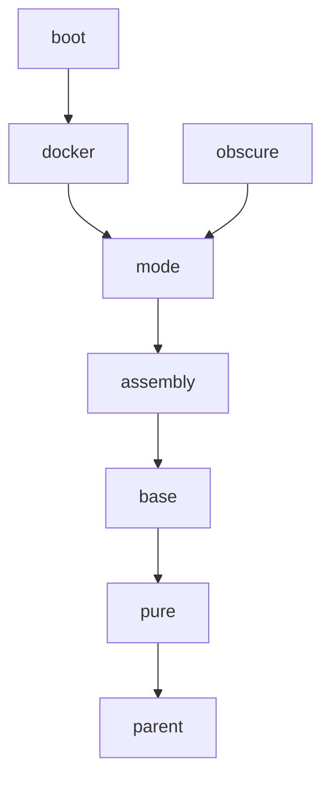

# maven parent pom

在构建基于Maven的项目时，可以在`pom.xml`文件中，通过`<parent>`来复用一些预定义的依赖和项目描述信息。

本项目中，提供了一些常用的预定义依赖，它们包括：

| 名称 | 用途 |
| ---| --- |
| [parent](#parent) | 所有父项目的继承根。其中预定义了项目的编码设置；预定义了site和release plugin设置 |
| [pure](#pure) | 预定义纯Java相关的设置，包括编译级别；java打包相关的plugin设置；代码质量相关的report plugin设置 |

这些父项目的继承关系如下：

---

### parent

---

### pure
