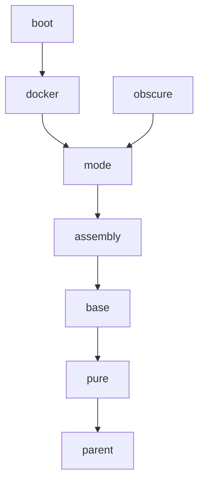

# maven parent pom

在构建基于Maven的项目时，可以在`pom.xml`文件中，通过`<parent>`来复用一些预定义的依赖和项目描述信息。

本项目中，提供了一些常用的预定义依赖，它们包括：

| 名称 | 用途 |
| ---| --- |
| parent | 所有父项目的继承根。包含项目的编码设置；Maven基础插件版本；代码发布相关设置 |
| pure | 预定义纯Java相关的设置，包括编译级别；java打包相关的plugin设置；代码质量相关的report plugin设置 |

本文包含以下内容：

1. [继承关系](#继承关系)
1. [预定义的配置项](#预定义的配置项)
1. [预定义的依赖包](#预定义的依赖包)
1. [预定义的插件](#预定义的插件)
1. [预定义的插件声明](#预定义的插件声明)
1. [预定义的Profile](#预定义的profile)
1. [Git仓库相关配置](#git仓库相关配置)

### 继承关系

这些父项目之间的继承关系如下：



---

### 预定义的配置项

父项目中以`<property>`的方式预定义了一些配置项，在子项目中可以通过覆盖的方式修改这些配置项，以达到定制化的目的。

预定义的配置项如下：

| 父项目 | 属性 | 默认值 | 描述 |
| --- | --- | --- | --- |
| parent | project.encoding | UTF-8 | 项目的默认编码 |
| parent | project.build.sourceEncoding | ${project.encoding} | 源文件的默认编码 |
| parent | project.reporting.outputEncoding | ${project.encoding} | 报告输出文件的默认编码 |
| parent | project.site.root | file://${env.HOME}/.m2/sites | 本地报告站点的根目录，profile`site-local`激活时 |
| parent | project.site.root.project | ${project.site.root}/${project.git.uri} | 本地报告站点的项目根目录，profile`site-local`激活时 |

---

### 预定义的依赖包

---

### 预定义的插件

本系统中包含如下预定义的插件：

| 父项目 | groupId | artifactId | 备注 | 
| --- | --- | --- | --- |
| parent | org.codehaus.mojo | versions-maven-plugin | 生成报告时 |
| parent | org.apache.maven.plugins | maven-gpg-plugin | profile`release`激活时 |
| parent | org.apache.maven.plugins | maven-release-plugin | profile`release`激活时 |
| parent | org.sonatype.plugins | nexus-staging-maven-plugin | profile`distribution-ossrh`激活时 |

---

### 预定义的插件声明

插件声明`<pluginManagement>`用于声明插件的版本信息和配置项模版。本系统中包含如下预定义的插件声明：

| 父项目 | 属性 | 默认版本 | groupId | artifactId | 备注 | 
| --- | --- | --- | --- | --- | --- |
| parent | version.maven-antrun-plugin | 3.0.0 | org.apache.maven.plugins | maven-antrun-plugin |
| parent | version.maven-assembly-plugin | 3.3.0 | org.apache.maven.plugins | maven-assembly-plugin |
| parent | version.maven-clean-plugin | 3.1.0 | org.apache.maven.plugins | maven-clean-plugin |
| parent | version.maven-dependency-plugin | 3.2.0 | org.apache.maven.plugins | maven-dependency-plugin |
| parent | version.maven-deploy-plugin | 3.0.0-M1 | org.apache.maven.plugins | maven-deploy-plugin |
| parent | version.maven-install-plugin | 3.0.0-M1 | org.apache.maven.plugins | maven-install-plugin |
| parent | version.maven-project-info-reports-plugin | 3.1.2 | org.apache.maven.plugins | maven-project-info-reports-plugin |
| parent | version.maven-site-plugin | 3.9.1 | org.apache.maven.plugins | maven-site-plugin |
| parent | version.versions-maven-plugin | 2.8.1 | org.codehaus.mojo | versions-maven-plugin |
| parent | version.maven-gpg-plugin | 3.0.1 | org.apache.maven.plugins | maven-gpg-plugin | profile`release`激活时 |
| parent | version.maven-release-plugin | 3.0.0-M4 | org.apache.maven.plugins | maven-release-plugin | profile`release`激活时 |
| parent | version.nexus-staging-maven-plugin | 1.6.8 | org.sonatype.plugins | nexus-staging-maven-plugin | profile`distribution-ossrh`激活时 |

---

### 预定义的Profile

`<profile>`是符合预定条件时才激活的配置片段。本系统中包含如下预定义的`Profile`：

| 父项目 | Profile | 激活条件 | 用途 | 
| --- | --- | --- | --- |
| parent | release | 手动 | 在发布版本时使用：`mvn release:prepare -P release` |
| parent | distribution-ossrh | 手动 | 用于提交发布物到Maven中央仓库 |
| parent | distribution-github | 手动 | 用于提交发布物到Github个人Maven仓库 |
| parent | site-local | 手动 | 用于在本地生成站点报告 |

---

### git仓库相关配置

在根项目`parent`中，预定义了一些与git仓库相关的配置项，这些配置项的默认值以[github.com](https://github.com)为蓝本，如下所示：

|属性 | 默认值 | 描述 |
| --- | --- | --- |
| project.git.host | github.com | git仓库的域名 |
| project.git.user | dbstarll | git仓库中的用户名 |
| project.git.group | ${project.git.user} | git仓库中的项目组名 |
| project.git.project | parent | git仓库中的项目名称 |
| project.git.branch.master | main | git仓库中的项目的主分支名称 |
| project.git.uri | ${project.git.host}/${project.git.user}/${project.git.project} | git仓库中的项目地址的uri部分 |
| project.git.web.root | https://${project.git.uri} | git仓库中的项目的web根地址 |
| project.git.web.master | ${project.git.web.root}/tree/${project.git.branch.master} | git仓库中的项目主分支的web地址 |
| project.git.git.root | git@${project.git.uri}.git | git仓库中的项目的git根地址 |

在每个直接继承父项目的子项目中，都需要在`pom.xml`中覆盖定义以下片段，否则这些片段会继承父项目中的定义，然后导致路径叠加异常：

```
  <name>your project name</name>
  <description>your project description</description>
  <url>https://your project url</url>
```

```xml
  <scm>
    <connection>scm:git:${project.git.git.root}</connection>
    <developerConnection>scm:git:${project.git.web.root}</developerConnection>
    <url>${project.git.web.master}</url>
    <tag>HEAD</tag>
  </scm>
```

```xml
    <profile>
      <id>site-local</id>
      <properties>
        <project.site.root>file://${env.HOME}/.m2/sites</project.site.root>
        <project.site.root.project>${project.site.root}/${project.git.uri}</project.site.root.project>
      </properties>
      <distributionManagement>
        <site>
          <id>local</id>
          <url>${project.site.root.project}</url>
        </site>
      </distributionManagement>
    </profile>
```

---

