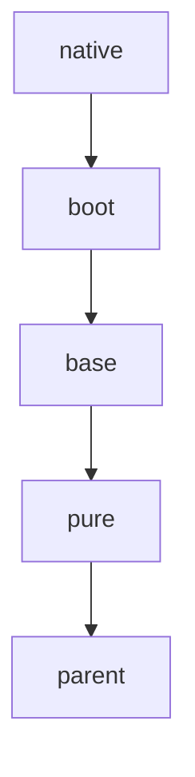

# maven parent pom

在构建基于Maven的项目时，可以在`pom.xml`文件中，通过`<parent>`来复用一些预定义的依赖和项目描述信息。

本文件是面向下游项目使用者的**权威配置参考**（全部版本号、属性默认值、依赖/插件/Profile 清单以此为准）；面向 AI 编码代理的操作指南见 [AGENTS.md](AGENTS.md)。

本项目中，提供了一些常用的预定义依赖，它们包括：

| 名称 | 用途 |
| ---| --- |
| parent | 所有父项目的继承根。包含项目的编码设置；Maven基础插件版本；代码发布相关设置 |
| pure | 用于纯Java的父项目。包含编译级别；打包相关的插件设置；站点报告插件设置（代码质量报告通过Sonar生成） |
| base | 引入常用的基准依赖包。包含slf4j、Apache Commons、Lombok和JUnit 5测试环境（java-test Profile） |
| boot | 以spring-boot.jar的方式来打包可执行jar，并通过spring-boot-dependencies做依赖管理 |
| native | 用于GraalVM native image构建的父项目。包含Spring AOT+native编译骨架、Tracing Agent反射元数据采集；不动版本基线，基线由子项目自定 |

本文包含以下内容：

1. [继承关系](#继承关系)
1. [预定义的配置项](#预定义的配置项)
1. [预定义的依赖](#预定义的依赖)
1. [预定义的依赖声明](#预定义的依赖声明)
1. [预定义的插件](#预定义的插件)
1. [预定义的插件声明](#预定义的插件声明)
1. [预定义的Profile](#预定义的profile)
1. [代码仓库相关配置](#代码仓库相关配置)

### 继承关系

这些父项目之间的继承关系如下：


```mermaid
graph TD;
    pure-->parent;
    base-->pure;
    boot-->base;
    native-->boot;
```

---

### 预定义的配置项

父项目中以`<property>`的方式预定义了一些配置项，在子项目中可以通过覆盖的方式修改这些配置项，以达到定制化的目的。

预定义的配置项如下：

| 父项目 | 属性 | 默认值 | 描述 |
| --- | --- | --- | --- |
| parent | project.encoding | UTF-8 | 项目的默认编码 |
| parent | project.build.sourceEncoding | `${project.encoding}` | 源文件的默认编码 |
| parent | project.reporting.outputEncoding | `${project.encoding}` | 报告输出文件的默认编码 |
| parent | project.site.root | `file://${env.HOME}/.m2/sites` | 本地报告站点的根目录，Profile`site-local`激活时 |
| parent | project.site.root.project | `${project.site.root}/${project.git.uri}` | 本地报告站点的项目根目录，Profile`site-local`激活时 |
| pure | project.java.version | 8 | Java版本，必须使用纯数字格式（8/11/17） |
| pure | maven.compiler.parameters | true | 编译时保留方法参数名（供Spring/Jackson反射使用） |
| pure | maven.compiler.source | `${project.java.version}` | Java源文件版本，Profile`jdk8`激活时 |
| pure | maven.compiler.target | `${project.java.version}` | Java编译文件版本，Profile`jdk8`激活时 |
| pure | maven.compiler.release | `${project.java.version}` | Java编译发行版本，Profile`jdk9+`激活时 |
| pure | maven.compiler.proc | full | 启用全量注解处理，Profile`jdk23+`激活时 |
| boot | project.mainClass | 无默认值，必须在子项目中设置 | 可执行jar的主类，Profile`spring-boot`激活时 |
| boot | project.spring-boot.attach | false | 是否发布Spring Boot打包后的可执行Jar，Profile`spring-boot`激活时 |
| boot | project.spring-boot.classifier | boot | 可执行Jar的classifier后缀名称，Profile`spring-boot`激活时 |
| native | project.native.outputDirectory | `${project.build.directory}/native` | native二进制的产出目录，默认放target/native/随mvn clean清理；docker build通过`-f`指定Dockerfile、以该目录作为context，Profile`native-build`激活时 |
| native | project.native.march | compatibility | native编译的`-march`参数（防旧CPU节点ISA报错），Profile`native-build`激活时 |
| native | project.native.agent.config.dir | `${project.build.directory}/native` | Tracing Agent反射元数据采集输出目录，Profile`native-trace`激活时；同时默认作为Profile`native-build`的`-H:ConfigurationFileDirectories`输入 |

---

### 预定义的依赖

本系统中包含如下预定义的依赖：

| 父项目 | groupId | artifactId | 备注 | 
| --- | --- | --- | --- |
| base | org.junit.jupiter | junit-jupiter | test，聚合构件（api+params+engine），Profile`java-test`激活时 |
| base | org.slf4j | slf4j-api |
| base | org.slf4j | jul-to-slf4j | runtime |
| base | org.slf4j | jcl-over-slf4j | runtime |
| base | org.apache.commons | commons-lang3 |
| base | commons-io | commons-io |

---

### 预定义的依赖声明

依赖声明`<dependencyManagement>`用于声明依赖项的版本信息。本系统中包含如下预定义的依赖声明：

| 父项目 | 属性 | 默认版本 | groupId | artifactId | 备注 | 
| --- | --- | --- | --- | --- | --- |
| base | version.junit-jupiter | 5.14.4 | org.junit | junit-bom | import，Profile`java-test`激活时 |
| base | version.slf4j | 2.0.18 | org.slf4j | slf4j-api |
| base | version.slf4j | 2.0.18 | org.slf4j | jul-to-slf4j |
| base | version.slf4j | 2.0.18 | org.slf4j | jcl-over-slf4j |
| base | version.slf4j | 2.0.18 | org.slf4j | log4j-over-slf4j |
| base | version.commons-lang3 | 3.20.0 | org.apache.commons | commons-lang3 |
| base | version.commons-io | 2.22.0 | commons-io | commons-io |
| base | version.commons-codec | 1.22.0 | commons-codec | commons-codec |
| base | version.commons-beanutils | 1.11.0 | commons-beanutils | commons-beanutils |
| base | version.commons-collections4 | 4.5.0 | org.apache.commons | commons-collections4 |
| base | version.lombok | 1.18.46 | org.projectlombok | lombok | optional=true，编译期注解处理器；boot 层的 spring-boot-maven-plugin 默认排除，避免进入可执行 jar |
| boot | version.slf4j | 1.7.36 | org.slf4j | slf4j-api及jul/jcl/log4j桥接包 | 覆盖base的2.0.18，适配logback 1.2绑定机制 |
| boot | version.junit-jupiter | 5.8.2 | org.junit | junit-bom | import，主干生效；覆盖base的5.14.4与spring-boot 2.7.18策展版一致，前置导入防BOM接管 |
| boot | version.spring-boot | 2.7.18 | org.springframework.boot | spring-boot-dependencies | import，主干生效，logback等base未钉版的构件由spring策展版接管 |

---

### 预定义的插件

本系统中包含如下预定义的插件：

| 父项目 | groupId | artifactId | 备注 | 
| --- | --- | --- | --- |
| parent | org.apache.maven.plugins | maven-enforcer-plugin |
| parent | org.codehaus.mojo | versions-maven-plugin | 生成报告时 |
| parent | org.apache.maven.plugins | maven-gpg-plugin | Profile`release`激活时 |
| parent | org.apache.maven.plugins | maven-release-plugin | Profile`release`激活时 |
| parent | org.sonatype.central | central-publishing-maven-plugin | Profile`distribution-central`激活时 |
| pure | org.apache.maven.plugins | maven-surefire-report-plugin | Profile`java-test`激活，生成报告时 |
| pure | org.jacoco | jacoco-maven-plugin | Profile`java-test`激活时 |
| pure | org.apache.maven.plugins | maven-failsafe-plugin | Profile`java-test`激活时，执行 integration-test/verify goals |
| base | pl.project13.maven | git-commit-id-plugin | Profile`java-main`激活时 |
| pure | org.codehaus.mojo | build-helper-maven-plugin | Profile`java-it`激活时，注册`src/it/java`为测试源码目录 |
| boot | org.springframework.boot | spring-boot-maven-plugin | Profile`spring-boot`激活时；默认排除`lombok`，避免其进入可执行 jar |
| native | org.graalvm.buildtools | native-maven-plugin | Profile`native-build`激活时 |

---

### 预定义的插件声明

插件声明`<pluginManagement>`用于声明插件的版本信息和配置项模版。本系统中包含如下预定义的插件声明：

| 父项目 | 属性 | 默认版本 | groupId | artifactId | 备注 | 
| --- | --- | --- | --- | --- | --- |
| parent | version.maven-enforcer-plugin | 3.6.3 | org.apache.maven.plugins | maven-enforcer-plugin |
| parent | version.maven-antrun-plugin | 3.2.0 | org.apache.maven.plugins | maven-antrun-plugin |
| parent | version.maven-clean-plugin | 3.5.0 | org.apache.maven.plugins | maven-clean-plugin |
| parent | version.maven-dependency-plugin | 3.11.0 | org.apache.maven.plugins | maven-dependency-plugin |
| parent | version.maven-deploy-plugin | 3.1.4 | org.apache.maven.plugins | maven-deploy-plugin |
| parent | version.maven-install-plugin | 3.1.4 | org.apache.maven.plugins | maven-install-plugin |
| parent | version.maven-project-info-reports-plugin | 3.9.0 | org.apache.maven.plugins | maven-project-info-reports-plugin |
| parent | version.maven-site-plugin | 3.22.0 | org.apache.maven.plugins | maven-site-plugin |
| parent | version.versions-maven-plugin | 2.21.0 | org.codehaus.mojo | versions-maven-plugin |
| parent | version.maven-release-plugin | 3.3.1 | org.apache.maven.plugins | maven-release-plugin |
| parent | version.maven-gpg-plugin | 3.2.8 | org.apache.maven.plugins | maven-gpg-plugin | Profile`release`激活时 |
| parent | version.central-publishing-maven-plugin | 0.11.0 | org.sonatype.central | central-publishing-maven-plugin | Profile`distribution-central`激活时 |
| pure | version.maven-compiler-plugin | 3.15.0 | org.apache.maven.plugins | maven-compiler-plugin |
| pure | version.maven-jar-plugin | 3.5.1 | org.apache.maven.plugins | maven-jar-plugin |
| pure | version.maven-javadoc-plugin | 3.12.0 | org.apache.maven.plugins | maven-javadoc-plugin |
| pure | version.maven-resources-plugin | 3.5.0 | org.apache.maven.plugins | maven-resources-plugin |
| pure | version.maven-source-plugin | 3.4.0 | org.apache.maven.plugins | maven-source-plugin |
| pure | version.maven-surefire-plugin | 3.5.6 | org.apache.maven.plugins | maven-surefire-plugin | Profile`java-test`激活时 |
| pure | version.maven-surefire-report-plugin | 3.5.6 | org.apache.maven.plugins | maven-surefire-report-plugin | Profile`java-test`激活时 |
| pure | version.jacoco-maven-plugin | 0.8.15 | org.jacoco | jacoco-maven-plugin | Profile`java-test`激活时 |
| pure | version.maven-failsafe-plugin | 3.5.6 | org.apache.maven.plugins | maven-failsafe-plugin | Profile`java-test`激活时 |
| base | version.git-commit-id-plugin | 4.9.10 | pl.project13.maven | git-commit-id-plugin | Profile`java-main`激活时 |
| pure | version.build-helper-maven-plugin | 3.6.0 | org.codehaus.mojo | build-helper-maven-plugin | Profile`java-it`激活时 |
| boot | version.spring-boot | 2.7.18 | org.springframework.boot | spring-boot-maven-plugin | Profile`spring-boot`激活时 |
| native | version.native-maven-plugin | 1.1.6 | org.graalvm.buildtools | native-maven-plugin | Profile`native-build`激活时，完整声明于`<plugins>`（extensions=true必须在实际声明处） |
| native | version.maven-shared-utils | 3.4.2 | org.apache.maven.shared | maven-shared-utils | native-maven-plugin的插件依赖钉版（其引用了该类库但未声明，Maven 3.9+不再提供） |

---

### 预定义的profile

`<profile>`是符合预定条件时才激活的配置片段。本系统中包含如下预定义的`Profile`：

| 父项目 | Profile | 激活条件 | 用途 | 
| --- | --- | --- | --- |
| parent | release | 手动 | 在发布版本时使用：`mvn release:prepare -P release`，生成gpg签名 |
| parent | distribution-central | 手动 | 用于提交发布物到Maven中央仓库（Central Portal） |
| parent | distribution-github | 手动 | 用于提交发布物到Github个人Maven仓库 |
| parent | site-local | 手动 | 用于在本地生成站点报告 |
| pure | jdk8 | JDK版本为1.8 | 设置`maven.compiler.source`/`target` |
| pure | jdk9+ | JDK版本≥9 | 设置`maven.compiler.release` |
| pure | jdk23+ | JDK版本≥23 | 设置`maven.compiler.proc`为full（JDK23起javac不再默认执行注解处理） |
| pure | java-main | 存在目录：src/main/java | 生成jar、配置javadoc.jar、source.jar和相关报告 |
| base | java-main | 存在目录：src/main/java | 与pure的同名Profile合并，执行git-commit-id-plugin:revision生成git.properties（无.git目录时跳过） |
| pure | java-test | 存在目录：src/test/java | 执行单元测试、集成测试（通过`maven-failsafe-plugin`）、代码覆盖率报告、生成test.jar、配置test-javadoc.jar、test-source.jar和相关报告 |
| pure | java-it | 存在目录：src/it/java | 通过`build-helper-maven-plugin`将`src/it/java`注册为测试源码目录；执行由`java-test` Profile中的`maven-failsafe-plugin`负责 |
| pure | release | 手动 | 生成javadoc.jar、source.jar |
| boot | spring-boot | 存在目录：src/main/java | 执行spring-boot-maven-plugin:repackage goal来打包可执行jar |
| native | native-build | 手动 | Spring AOT处理+GraalVM编译native二进制到`${project.native.outputDirectory}`；默认将native-trace产出目录（`${project.native.agent.config.dir}`）作为反射元数据输入，目录不存在时被静默忽略（已实测）；通用buildArg已固化（`combine.children=append`），项目特定buildArg由子项目定义同名Profile合并追加。两步构建顺序：`mvn clean verify -Pnative-trace -U -B`→`mvn package -Pnative-build -DskipTests -B`，第二步不clean以复用第一步产物；docker build通过`-f Dockerfile.native target/native`指定Dockerfile与context。激活时要求构建JDK≥17（native-maven-plugin的Maven扩展按Java 17编译），native编译本就需要GraalVM JDK，正常流程无影响 |
| native | native-trace | 手动 | surefire与failsafe均挂Tracing Agent，采集反射元数据到`${project.native.agent.config.dir}`；surefire使用`config-output-dir`，failsafe使用`config-merge-dir` |

---

### Spring Boot 3.x 适配

`boot` 父项目默认基线保持 **Spring Boot 2.7.18 + JDK 8**（`version.spring-boot=2.7.18`、`version.slf4j=1.7.36`、`version.junit-jupiter=5.8.2`），以保证对存量 JDK 8 项目的兼容。

若下游项目需迁移到 **Spring Boot 3.x + JDK 17**，只需在子项目的根 `pom.xml` 中覆盖以下属性即可，无需修改父项目：

```xml
<properties>
  <project.java.version>17</project.java.version>
  <version.spring-boot>3.5.16</version.spring-boot>
  <version.slf4j>2.0.18</version.slf4j>
  <version.junit-jupiter>5.12.2</version.junit-jupiter>
</properties>
```

参考实践：
- `account-core`（库项目，继承 `io.github.dbstarll.parent:boot`，`master-boot3-java17` 分支）
- `spring-boot-use-core`（可执行应用，继承 `io.github.dbstarll.parent:native`）

两者均已按上述方式覆盖，且 `mvn clean verify` 构建通过。

---

### Spring Boot 4.x 适配

`boot` 父项目默认基线仍为 **Spring Boot 2.7.18 + JDK 8**（见上节）。迁移到 **Spring Boot 4.x + JDK 25**，同样只需在子项目根 `pom.xml` 中覆盖属性：

```xml
<properties>
  <project.java.version>25</project.java.version>
  <version.spring-boot>4.1.0</version.spring-boot>
  <version.slf4j>2.0.18</version.slf4j>
  <version.junit-jupiter>6.0.3</version.junit-jupiter>
</properties>
```

与 3.x 适配的差异点：

- **JDK 要求**：Spring Boot 4 最低 JDK 17，实践上使用 JDK 25（`project.java.version=25`，编译参数、注解处理、JaCoCo 等由 `pure` 层按 JDK 版本自动适配）
- **JUnit 6**：`spring-boot-dependencies` 4.x 策展 JUnit 6，覆盖值取 `6.0.3`（`org.junit:junit-bom` 坐标不变）；`slf4j` 覆盖值与 3.x 相同（`2.0.18`，与 4.x 策展版一致）
- **不再策展的构件**：`logstash-logback-encoder` 已从 4.x BOM 移除，如使用需在子项目自行钉版；`springdoc-openapi` 从未被策展，Boot 4 需使用其 3.x 版本并自行管理
- **库项目附加项**：全部模块为库、无 main class 时，建议加 `<spring-boot.repackage.skip>true</spring-boot.repackage.skip>` 屏蔽 `spring-boot` Profile 的 repackage

参考实践：
- `account-core`（库项目，继承 `io.github.dbstarll.parent:boot`，`master-boot4-java25` 分支，已按上述方式覆盖且 `mvn clean install` 构建通过）

---

### 代码仓库相关配置

在根项目`parent`中，预定义了一些与git仓库相关的配置项，这些配置项的默认值以[github.com](https://github.com)为蓝本，如下所示：

|属性 | 默认值 | 描述 |
| --- | --- | --- |
| project.git.host | github.com | git仓库的域名 |
| project.git.user | dbstarll | git仓库中的用户名 |
| project.git.group | dbstar-org | git仓库中的项目组名 |
| project.git.project | parent | git仓库中的项目名称 |
| project.git.branch.master | main | git仓库中的项目的主分支名称 |
| project.git.uri | `${project.git.host}/${project.git.group}/${project.git.project}` | git仓库中的项目地址的uri部分 |
| project.git.web.root | `https://${project.git.uri}` | git仓库中的项目的web根地址 |
| project.git.web.master | `${project.git.web.root}/tree/${project.git.branch.master}` | git仓库中的项目主分支的web地址 |
| project.git.git.root | `git@${project.git.uri}.git` | git仓库中的项目的git根地址 |

在每个直接继承父项目的子项目中，都需要在`pom.xml`中覆盖定义以下片段，否则这些片段会继承父项目中的定义，然后导致路径叠加异常：

```
  <description>your project description</description>
  <url>https://your project url</url>
```

```xml
  <scm>
    <connection>scm:git:${project.git.git.root}</connection>
    <developerConnection>scm:git:${project.git.web.root}</developerConnection>
    <url>${project.git.web.master}</url>
    <tag>HEAD</tag>
  </scm>
```

```xml
    <profile>
      <id>site-local</id>
      <distributionManagement>
        <site>
          <id>local</id>
          <url>${project.site.root.project}</url>
        </site>
      </distributionManagement>
    </profile>
```

---
